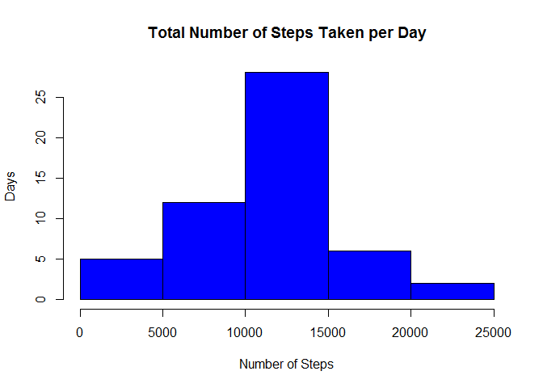
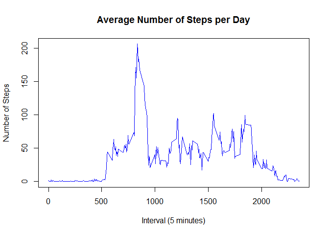
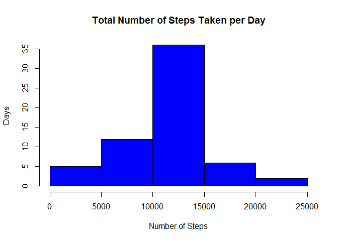
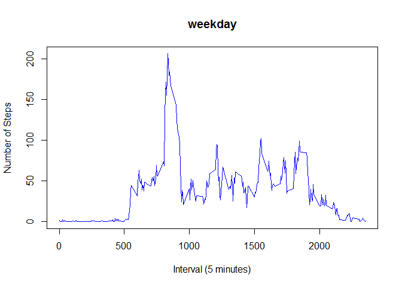

# Reproducible Research: Peer Assessment 1


### Loading and preprocessing the data


```r
rm(list=ls()) # Clear the Workspace
setwd("C:/Users/John/Github/RepData_PeerAssessment1") # Setup the Workspace
unzip("activity.zip", overwrite=TRUE) # Unzip the dataset
activity <- read.csv("activity.csv") # Read the dataset
```

```r
head(activity)  # Exploring the data
```

```
##   steps       date interval
## 1    NA 2012-10-01        0
## 2    NA 2012-10-01        5
## 3    NA 2012-10-01       10
## 4    NA 2012-10-01       15
## 5    NA 2012-10-01       20
## 6    NA 2012-10-01       25
```


### What is mean total number of steps taken per day?


```r
steps <- aggregate(steps ~ date, data = activity, sum, na.rm = TRUE)  # Total the steps per day
```

```r
summary(steps)  # Summarize the data
```

```
##          date        steps      
##  2012-10-02: 1   Min.   :   41  
##  2012-10-03: 1   1st Qu.: 8841  
##  2012-10-04: 1   Median :10765  
##  2012-10-05: 1   Mean   :10766  
##  2012-10-06: 1   3rd Qu.:13294  
##  2012-10-07: 1   Max.   :21194  
##  (Other)   :47
```

1.  Make a histogram of the total number of steps taken per day?


```r
hist(steps$steps,
     main = "Total Number of Steps Taken per Day",
     xlab = "Number of Steps",
     ylab = "Days",
     col="blue")
```

 

2.  Calculate and report the **mean** and **median** total number of steps taken per day


```r
mean(steps$steps)
```

```
## [1] 10766
```
**The mean = 10766**  


```r
median(steps$steps)
```

```
## [1] 10765
```
**The median = 10765**  


### What is the average daily activity pattern?


```r
interval <- aggregate(steps ~ interval, data = activity, mean, na.rm = TRUE) # Average the steps per interval
```

```r
summary(interval)  # Summarize the data
```

```
##     interval        steps       
##  Min.   :   0   Min.   :  0.00  
##  1st Qu.: 589   1st Qu.:  2.49  
##  Median :1178   Median : 34.11  
##  Mean   :1178   Mean   : 37.38  
##  3rd Qu.:1766   3rd Qu.: 52.83  
##  Max.   :2355   Max.   :206.17
```

1.  Make a time series plot (i.e. type = "l") of the 5-minute interval (x-axis) and the average number of steps taken, averaged across all days (y-axis)


```r
plot(interval, type = "l",
    main = ("Average Number of Steps per Day"), 
    xlab = "Interval (5 minutes)",
    ylab = "Number of Steps",
    col="blue")
```

 

2.  Which 5-minute interval, on average across all the days in the dataset, contains the maximum number of steps?


```r
interval$interval[which.max(interval$steps)]  # Find the interval with the most steps
```

```
## [1] 835
```
**The interval = 835**

### Imputing missing values

1.  Calculate and report the total number of missing values in the dataset (i.e. the total number of rows with NAs)


```r
sum(is.na(activity))
```

```
## [1] 2304
```

**There are 2304 missing values in the dataset**

2.  Devise a strategy for filling in all of the missing values in the dataset. The strategy does not need to be sophisticated. For example, you could use the mean/median for that day, or the mean for that 5-minute interval, etc.

**I will populate all NA values with the interval mean**


```r
imputed.activity <- activity  # Copy the activity data frame to a new one
imputed.activity$steps[is.na(imputed.activity$steps)] <- mean(interval$steps)  # Update NAs = Interval Mean
```

```r
head(imputed.activity)
```

```
##   steps       date interval
## 1 37.38 2012-10-01        0
## 2 37.38 2012-10-01        5
## 3 37.38 2012-10-01       10
## 4 37.38 2012-10-01       15
## 5 37.38 2012-10-01       20
## 6 37.38 2012-10-01       25
```

3.  Create a new dataset that is equal to the original dataset but with the missing data filled in.


```r
imputed.steps <- aggregate(steps ~ date, data = imputed.activity, sum, na.rm = TRUE)  # Total the steps per day
```

```r
summary(imputed.steps)  # Summarize the data
```

```
##          date        steps      
##  2012-10-01: 1   Min.   :   41  
##  2012-10-02: 1   1st Qu.: 9819  
##  2012-10-03: 1   Median :10766  
##  2012-10-04: 1   Mean   :10766  
##  2012-10-05: 1   3rd Qu.:12811  
##  2012-10-06: 1   Max.   :21194  
##  (Other)   :55
```

4.  Make a histogram of the total number of steps taken each day and Calculate and report the **mean** and **median** total number of steps taken per day. Do these values differ from the estimates from the first part of the assignment? What is the impact of imputing missing data on the estimates of the total daily number of steps?


```r
hist(imputed.steps$steps,
     main = "Total Number of Steps Taken per Day",
     xlab = "Number of Steps",
     ylab = "Days",
     col="blue")
```

 

```r
mean(imputed.steps$steps)
```

```
## [1] 10766
```
**The mean = 10766**  


```r
median(imputed.steps$steps)
```

```
## [1] 10766
```
**The median = 10765** 

### Are there differences in activity patterns between weekdays and weekends?

1.  Create a new factor variable in the dataset with two levels -- "weekday" and "weekend" indicating whether a given date is a weekday or weekend day.


```r
activity.days <- activity  # Copy the source data
activity.days$day = ifelse(as.POSIXlt(as.Date(activity$date))$wday%%6 == 0, "weekend", "weekday")  # Is Weekend?
activity.days$day = factor(activity.days$day, levels = c("weekday", "weekend"))
```

2.  Make a panel plot containing a time series plot (i.e. type = "l") of the 5-minute interval (x-axis) and the average number of steps taken, averaged across all weekday days or weekend days (y-axis).


```r
for (day in c("weekend", "weekday")) {
    steps.day <- aggregate(steps ~ interval, data = activity.days, subset = activity.days$day == 
        day, mean)
    plot(steps.day, type = "l",
         main = day,
         xlab = "Interval (5 minutes)",
         ylab = "Number of Steps",
         col = "blue")
    
}
```

  

**There is not a visible difference in activity patterns between weekdays and weekends.**
